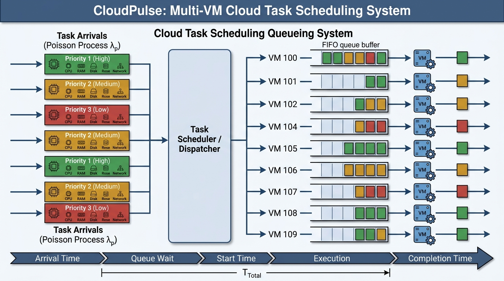

# CloudPulse-Sim

> Cloud Data Center Performance Modelling & Simulation Engine

A performance modelling system for cloud task scheduling, built as a mini-project for **EEI6373 – Performance Modelling** at the Open University of Sri Lanka. CloudPulse-Sim ingests a real-world cloud task scheduling dataset, runs a Discrete Event Simulation (DES) to derive queueing metrics, computes statistical summaries, and generates interactive visualizations.



---

## Overview

Cloud data centers dispatch thousands of tasks to Virtual Machines (VMs) concurrently. Without performance modelling, it is impossible to identify bottlenecks, predict SLA violations, or optimize scheduling. CloudPulse-Sim addresses this by:

- Simulating task arrival, queueing, and execution across 10 VMs
- Computing key performance metrics: queue wait time, response time, throughput, and resource utilization
- Producing charts across five report sections
- Exposing an HTTP API so a React frontend can process custom datasets

---

## Architecture

```
┌──────────────────────────────────────────────────────────┐
│                     CloudPulse-Sim                       │
│                                                          │
│  ┌─────────────┐    ┌──────────────┐    ┌────────────┐  │
│  │ Dataset CSV │───▶│  Go Engine   │───▶│  HTML      │  │
│  │ (Kaggle)    │    │  (main.go)   │    │  Charts    │  │
│  └─────────────┘    └──────┬───────┘    └────────────┘  │
│                            │                             │
│                     ┌──────▼───────┐                     │
│                     │  HTTP API    │  :8080               │
│                     │  /api/upload │                     │
│                     └──────┬───────┘                     │
│                            │                             │
│                     ┌──────▼───────┐                     │
│                     │   React /    │                     │
│                     │   Vite UI    │                     │
│                     └──────────────┘                     │
└──────────────────────────────────────────────────────────┘
```

---

## Features

- **Discrete Event Simulation** — models task arrivals, queueing, and VM execution with priority-weighted inter-arrival times
- **Statistical Analysis** — computes Mean, Std Dev, Min, Max, Median, and P95 for execution time, queue wait, and total response time
- **Priority Latency Breakdown** — quantifies how SLA degrades from High (Priority 1) to Low (Priority 3)
- **VM Resource Footprint** — average CPU, RAM, Disk I/O, and Network I/O per VM instance
- **SLA Compliance Ratio** — optimal vs. non-optimal scheduling breakdown per VM
- **9 Interactive Visualizations** — generated via `vizb` CLI as standalone HTML files
- **REST API** — accepts CSV uploads and returns processed JSON rows for the frontend
- **React Frontend** — interactive dashboard with Apache ECharts for in-browser exploration

---

## Dataset

The project uses the [Cloud Task Scheduling Dataset](https://www.kaggle.com/) from Kaggle.

| Column | Description |
|---|---|
| `Task_ID` | Unique task identifier |
| `CPU_Usage (%)` | CPU utilization percentage |
| `RAM_Usage (MB)` | Memory consumed |
| `Disk_IO (MB/s)` | Disk I/O rate |
| `Network_IO (MB/s)` | Network I/O rate |
| `Priority` | 1 = High, 2 = Medium, 3 = Low |
| `VM_ID` | Assigned VM instance (100–109) |
| `Execution_Time (s)` | Actual task runtime |
| `Target` | 1 = Optimal scheduling, 0 = Non-optimal |

Place your dataset file as `dataset.csv` in the project root before running.

---

## Prerequisites

| Tool | Version | Purpose |
|---|---|---|
| [Go](https://go.dev/dl/) | ≥ 1.20 | Engine & API server |
| [Node.js](https://nodejs.org/) | ≥ 18 | Frontend |
| [pnpm](https://pnpm.io/) | ≥ 8 | Frontend package manager |
| [vizb](https://github.com/goptics/vizb) | latest | Chart generation |

### Install vizb

```bash
go install github.com/goptics/vizb@latest
```

Or via the install script:

```bash
curl -fsSL https://vizb.goptics.org/install.sh | bash
```

---

## Quick Start

### 1. Clone the repository

```bash
git clone https://github.com/mayura-andrew/cloudpulse-sim.git
cd cloudpulse-sim
```

### 2. Add the dataset

```bash
cp cloud_task_scheduling_dataset.csv dataset.csv
```

### 3. Run the CLI engine

```bash
go run main.go
```

This will:
1. Ingest `dataset.csv`
2. Run the DES simulation
3. Export `processed_cloud_task_metrics.csv`
4. Print the statistical report to stdout
5. Generate 9 HTML visualization files

### 4. Run the full stack (API + Frontend)

```bash
# Terminal 1 — start the backend API
make run-server

# Terminal 2 — start the frontend dev server
make run-frontend
```

Open [http://localhost:5173](http://localhost:5173) in your browser.

---

## Makefile Commands

| Command | Description |
|---|---|
| `make build-server` | Build the Go server binary |
| `make run-server` | Run the Go API server on `:8080` |
| `make build-frontend` | Install dependencies and build the frontend bundle |
| `make run-frontend` | Install dependencies and start the Vite dev server |

---

## Simulation Model

The DES is implemented in `simulateQueueingDynamics()` in [`main.go`](main.go).

### Inter-arrival Time

Task arrivals follow a **priority-weighted pseudo-Poisson process**:

```
prioWeight   = 1.6 − (Priority − 1) × 0.2
interArrival = (1.5 + (TaskID × 13 mod 3.5)) × prioWeight
```

Lower-priority tasks experience a higher inter-arrival weight, simulating realistic SLA degradation under load.

### Event Sequence (per task)

```
arrivalTime    += interArrival
startTime       = max(arrivalTime, vmFreeTime[VM])
queueWait       = startTime − arrivalTime
completionTime  = startTime + executionTime
responseTime    = completionTime − arrivalTime
vmFreeTime[VM]  = completionTime
```

### Assumptions

- **FCFS** (First-Come-First-Served) within each VM queue
- No task migration between VMs after assignment
- No VM failure or preemption
- Execution times are sourced directly from the dataset

---

## Generated Visualizations

All charts are generated as self-contained HTML files using `vizb`.

| File | Description |
|---|---|
| `fig_section2_cpu_footprint.html` | Average CPU usage per VM |
| `fig_section2_ram_footprint.html` | Average RAM usage per VM |
| `fig_section2_disk_footprint.html` | Average Disk I/O per VM |
| `fig_section2_network_footprint.html` | Average Network I/O per VM |
| `fig_section3_performance_goals.html` | Task count & mean response time — Optimal vs Non-Optimal |
| `fig_section6_priority_wait.html` | Mean queue wait time by priority level |
| `fig_section7_histogram.html` | Distribution of execution time and total response time |
| `fig_section7_scatter_queue_growth.html` | Queue wait growth over time (Task_ID axis) |
| `fig_section7_vm_sla_ratio.html` | Optimal vs Non-Optimal scheduling ratio per VM |

---

## API Reference

The server starts on port **8080** when run with the `serve` flag (`go run main.go serve` or `make run-server`).

### `POST /api/upload`

Upload a CSV file for processing.

```bash
curl -X POST http://localhost:8080/api/upload \
  -F "file=@dataset.csv"
```

**Response:** JSON array of processed task rows including all simulation-derived metrics.

---

### `GET /api/process-default`

Process the `dataset.csv` file already present in the server workspace.

```bash
curl http://localhost:8080/api/process-default
```

**Response:** JSON array of processed task rows.

---

## Project Structure

```
cloudpulse-sim/
├── main.go                          # CLI engine — simulation, stats, vizb integration
├── go.sum                           # Go module checksums
├── Makefile                         # Build and run shortcuts
├── dataset.csv                      # Input dataset (add before running)
├── cloud_task_scheduling_dataset.csv    # Original Kaggle dataset (500 tasks)
├── cloud_task_scheduling_dataset_20k.csv # Extended dataset (20k tasks)
├── processed_cloud_task_metrics.csv # Simulation output (generated)
├── system_architecture.jpg          # Architecture diagram
├── report.txt                       # Mini project brief
├── server/                          # Go HTTP API server
│   ├── cmd/server/                  # Server entrypoint
│   ├── internal/                    # Internal packages
│   └── go.mod
└── frontend/                        # React + Vite dashboard
    ├── src/
    │   ├── App.tsx                  # Main application component
    │   ├── components/              # UI components
    │   ├── main.tsx                 # Entry point
    │   └── styles.css               # Global styles
    ├── package.json
    └── vite.config.ts
```

---

## Performance Metrics Computed

| Metric | Mean | Std Dev | Min | Max | P95 |
|---|---|---|---|---|---|
| Execution Time (s) | ✓ | ✓ | ✓ | ✓ | ✓ |
| Queue Wait Delay (s) | ✓ | ✓ | ✓ | ✓ | ✓ |
| Total Response Time (s) | ✓ | ✓ | ✓ | ✓ | ✓ |

**P95** (95th percentile) is the primary SLA metric — it represents the worst-case experience for 95% of tasks and is more meaningful than the mean for SLA compliance reporting.

---

## Frontend Stack

| Technology | Purpose |
|---|---|
| React 18 | UI framework |
| TypeScript | Type safety |
| Vite 5 | Build tool & dev server |
| Apache ECharts | Interactive charts |
| PapaParse | CSV parsing in the browser |

---

## Academic Context

This project was developed as a mini-project submission for:

> **EEI6373 – Performance Modelling**
> Department of Electrical & Computer Engineering
> Bachelor of Software Engineering
> The Open University of Sri Lanka

**Submission Date:** 10/07/2026

---

## License

This project is for academic purposes.
