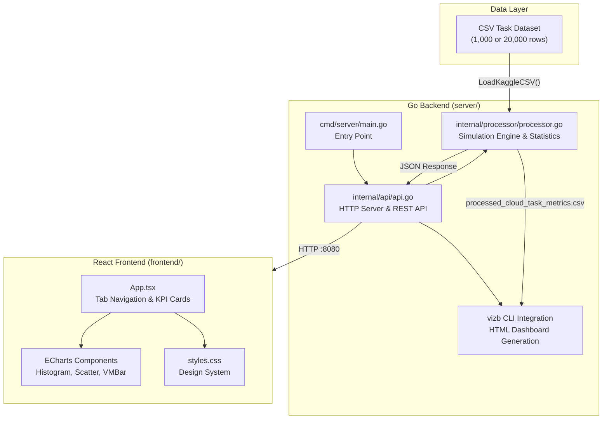
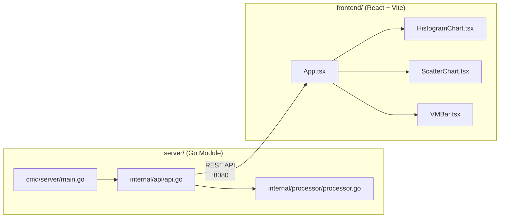
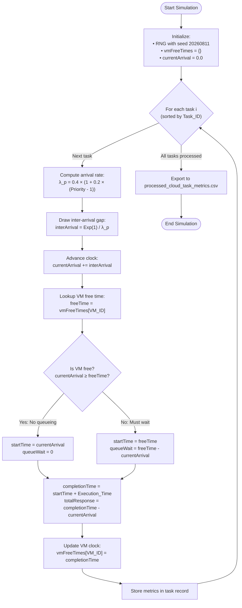
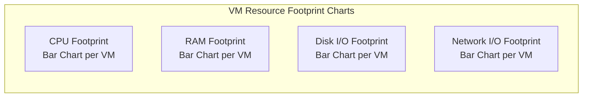
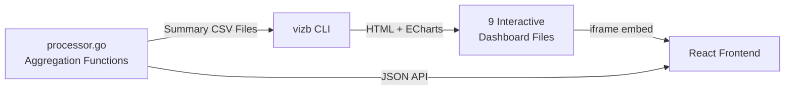
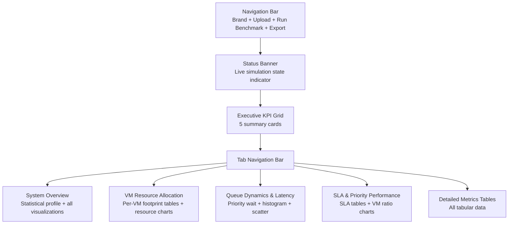

# CloudPulse: Performance Modeling and Evaluation of a Cloud Task Scheduling System

**Student**: Mayura Alahakoon  
**Module**: EEI6373 – Performance Modelling  
**Programme**: Bachelor of Software Engineering  
**Institution**: The Open University of Sri Lanka, Department of Electrical & Computer Engineering  
**Date**: August 2026

---

## Abstract

CloudPulse is a performance modeling system that evaluates the behavior of a multi-virtual-machine (VM) cloud task scheduling environment under stochastic workload conditions. The system ingests a real-world cloud task dataset containing 1,000 task records with resource usage profiles (CPU, RAM, Disk I/O, Network I/O), priority levels, VM assignments, execution times, and SLA target labels. It applies a discrete-event queueing simulation with exponentially distributed inter-arrival times, models per-VM FIFO service queues, and computes derived timing metrics including arrival time, queue waiting latency, service start time, completion time, and total turnaround time. The implementation is developed in Go with a modular server architecture and an interactive React-based frontend for presenting statistical summaries, tabular datasets, and HTML dashboard visualizations. This report details the system description, modeling approach, mathematical formulation, data methodology, implementation architecture, simulation output analysis, visualization descriptions, limitations, and future extensions.

**Keywords**: Performance Modeling, Queueing Theory, Cloud Computing, Discrete-Event Simulation, Multi-Server Queue, SLA Compliance, Go, React

---

## Table of Contents

1. [System Description and Performance Goals](#1-system-description-and-performance-goals)
2. [Modeling Approach and Assumptions](#2-modeling-approach-and-assumptions)
3. [Data Description and Methodology](#3-data-description-and-methodology)
4. [System Architecture and Implementation](#4-system-architecture-and-implementation)
5. [Simulation Algorithm](#5-simulation-algorithm)
6. [Queueing Equations and Mathematical Foundation](#6-queueing-equations-and-mathematical-foundation)
7. [Detailed Analysis and Findings](#7-detailed-analysis-and-findings)
8. [Visualizations](#8-visualizations)
9. [Frontend Presentation Layer](#9-frontend-presentation-layer)
10. [Limitations](#10-limitations)
11. [Future Extensions](#11-future-extensions)
12. [Conclusion](#12-conclusion)
13. [References](#13-references)
14. [Appendix A: Deliverables](#appendix-a-deliverables)

---

## 1. System Description and Performance Goals

### 1.1 System Overview

The system under study is a **cloud task scheduling environment** in which incoming computational tasks are assigned to one of ten virtual machine instances (VM 100 through VM 109). Each task carries a resource footprint — CPU utilization percentage, RAM allocation in megabytes, disk I/O throughput, and network bandwidth consumption — along with a priority level (1 = High, 2 = Medium, 3 = Low), a pre-assigned VM identifier, a deterministic execution duration, and an SLA optimality label.

The workload is sufficiently complex to expose several performance phenomena central to cloud computing systems:

- **Queue buildup**: Tasks arriving faster than their assigned VM can process them accumulate in FIFO queues.
- **Resource imbalance**: Non-uniform distribution of resource-intensive tasks across VMs leads to heterogeneous load patterns.
- **Response-time variation**: The combination of stochastic arrivals and deterministic service creates variable turnaround times.
- **Priority-induced congestion**: Differential arrival rates tied to priority levels create measurably different queueing experiences.
- **SLA divergence**: Optimal versus non-optimal scheduling targets exhibit distinct response-time profiles.

### 1.2 Performance Goals

The main performance objectives addressed by this study are:

1. **Minimize queue waiting time** ($T_{\text{Queue}}$) across all task arrivals.
2. **Minimize total turnaround time** ($T_{\text{Total}}$) — the end-to-end duration from task arrival to completion.
3. **Measure resource utilization per VM** — average CPU, RAM, Disk I/O, and Network I/O consumption across VM instances.
4. **Observe the effect of priority on delay** — quantify how lower-priority tasks experience disproportionately higher queue waiting latency.
5. **Compare SLA outcomes across VMs** — evaluate the ratio of optimal to non-optimal scheduling outcomes per VM.
6. **Present findings as a formal report with interactive visualizations** supporting each analytical claim.

---

## 2. Modeling Approach and Assumptions

### 2.1 Modeling Technique

The implementation uses a **discrete-event queueing model** with:

- **Stochastic arrivals**: Inter-arrival times follow an exponential distribution (Poisson process).
- **Deterministic service**: Execution times are taken directly from the dataset (known a priori).
- **Multiple servers**: Ten independent VMs, each acting as a single-server FIFO queue.

This corresponds to an $M/D/k$-style queueing model where:

- $M$ = Markovian (memoryless/exponential) arrivals
- $D$ = Deterministic service times
- $k$ = 10 parallel single-server queues

### 2.2 Assumptions

The following modeling assumptions are made:

1. **Task ordering**: Tasks are processed in ascending `Task_ID` order, which serves as a temporal proxy for arrival sequence.
2. **Static VM assignment**: Each task remains on its pre-assigned `VM_ID`; no task migration or load balancing occurs.
3. **Single-server per VM**: Each VM serves exactly one task at a time. If the VM is busy, arriving tasks wait in a FIFO queue.
4. **Priority via arrival pressure**: Lower-priority tasks arrive with a higher effective rate, creating heavier congestion for Priority 3 (Low) tasks relative to Priority 1 (High).
5. **No preemption**: A running task cannot be interrupted by a higher-priority arrival.
6. **Reproducibility**: A fixed random seed (`20260811`) ensures identical results across simulation runs.

### 2.3 Justification

Queueing models are the standard analytical tool for studying waiting phenomena in service systems (Kleinrock, 1975). The exponential inter-arrival model is justified by its mathematical tractability and its status as the natural distribution for modeling random event arrivals in communication and computing systems (Jain, 1991). Deterministic service is appropriate here because the execution times are provided by the dataset and are treated as known values rather than random variables.

---

## 3. Data Description and Methodology

### 3.1 Dataset

The input dataset is a CSV file containing **1,000 task records** sourced from a cloud task scheduling benchmark. Each record includes nine fields:

| Column | Description | Range / Type |
| :--- | :--- | :--- |
| `Task_ID` | Unique task identifier | 1 – 1,000 |
| `CPU_Usage (%)` | CPU utilization percentage | 30 – 94% |
| `RAM_Usage (MB)` | Memory allocation | 562 – 16,373 MB |
| `Disk_IO (MB/s)` | Storage I/O throughput | 5 – 99 MB/s |
| `Network_IO (MB/s)` | Network bandwidth | 1 – 49 MB/s |
| `Priority` | Task priority tier | 1 (High), 2 (Medium), 3 (Low) |
| `VM_ID` | Assigned virtual machine | 100 – 109 |
| `Execution_Time (s)` | Deterministic service duration | 1.01 – 9.98 s |
| `Target (Optimal Scheduling)` | SLA compliance label | 0 (Non-Optimal), 1 (Optimal) |

**Sample records** (first five rows):

| Task_ID | CPU % | RAM (MB) | Disk IO | Net IO | Priority | VM_ID | Exec Time (s) | Target |
| :---: | :---: | :---: | :---: | :---: | :---: | :---: | :---: | :---: |
| 1 | 37 | 2,612 | 55 | 40 | 2 | 107 | 1.27 | 1 |
| 2 | 86 | 11,761 | 55 | 12 | 3 | 106 | 3.71 | 1 |
| 3 | 44 | 4,610 | 6 | 1 | 2 | 101 | 8.53 | 0 |
| 4 | 82 | 12,604 | 29 | 18 | 3 | 106 | 7.31 | 0 |
| 5 | 59 | 15,945 | 54 | 11 | 1 | 102 | 1.76 | 1 |

### 3.2 Derived Fields

After simulation, the following timing metrics are computed and appended to each task record:

| Derived Field | Formula | Description |
| :--- | :--- | :--- |
| `Arrival_Time_s` | Cumulative exponential draws | Simulated task arrival timestamp |
| `Queue_Wait_s` | $t_{\text{start}} - t_{\text{arr}}$ | Time spent waiting in the VM queue |
| `Start_Time_s` | $\max(t_{\text{arr}}, t_{\text{VM\_free}})$ | When execution begins |
| `Completion_Time_s` | $t_{\text{start}} + T_{\text{Execution}}$ | When execution ends |
| `Total_Response_s` | $T_{\text{Queue}} + T_{\text{Execution}}$ | Full turnaround time |

The processed dataset is exported to `processed_cloud_task_metrics.csv` (14 columns, 1,000 rows) for downstream analysis and visualization.

### 3.3 Methodology

The data methodology follows these steps:

1. **Ingest**: Load and parse the raw CSV dataset.
2. **Sort**: Order tasks by `Task_ID` for stable causal sequencing.
3. **Simulate**: Run the discrete-event queueing simulation to compute all timing metrics.
4. **Export**: Write the enriched dataset to a processed CSV file.
5. **Aggregate**: Compute summary statistics (mean, standard deviation, median, P95, min, max) and per-group aggregations (per-VM, per-priority, per-SLA-target).
6. **Visualize**: Generate bar charts, scatter plots, and histograms from the aggregated data.
7. **Present**: Deliver the results through a web-based frontend with interactive dashboards.

---

## 4. System Architecture and Implementation

### 4.1 High-Level Architecture

The system is organized into three tiers:

### 4.2 Component Overview

### 4.3 Backend Components

| Component | File | Responsibility |
| :--- | :--- | :--- |
| **Entry Point** | `server/cmd/server/main.go` | Application bootstrap, delegates to `api.StartServer()` |
| **HTTP Server & API** | `server/internal/api/api.go` | REST endpoints (`POST /api/upload`, `GET /api/process-default`), JSON serialization, vizb dashboard orchestration, static file serving |
| **Simulation Engine** | `server/internal/processor/processor.go` | CSV parsing (`LoadKaggleCSV`), discrete-event queueing simulation (`SimulateQueueingDynamics`), statistical computation (`CalculateStats`), data aggregation functions |

### 4.4 API Endpoints

| Endpoint | Method | Description |
| :--- | :--- | :--- |
| `/api/upload` | `POST` | Accepts multipart CSV upload, runs simulation, returns JSON report |
| `/api/process-default` | `GET` | Processes workspace dataset automatically |
| `/vizb/*` | `GET` | Serves generated HTML dashboard files |
| `/` | `GET` | Serves the frontend SPA build (`frontend/dist/`) |

### 4.5 Frontend Components

The React frontend provides:

- **Executive KPI summary cards**: Workload Volume, Mean Turnaround Time, P95 Turnaround, Mean Queue Latency, Mean Service Duration, Cluster CPU Load.
- **Tabbed navigation**: System Overview, VM Resource Allocation, Queue Dynamics & Latency, SLA & Priority Performance, Detailed Metrics Tables.
- **Interactive visualizations**: Embedded vizb HTML dashboards with fullscreen viewing capability.
- **Data export**: One-click JSON report download.

---

## 5. Simulation Algorithm

### 5.1 Algorithm Flowchart

### 5.2 Simulation Walkthrough

The core simulation function `SimulateQueueingDynamics` processes each task as follows:

**Step 1 — Compute priority-adjusted arrival rate:**

The base arrival rate $\lambda_0 = 0.4$ tasks per second is scaled by priority:

$$\lambda_p = \lambda_0 \times (1 + 0.2 \times (p - 1))$$

| Priority Level | Description | Scaling Factor | Effective Rate $\lambda_p$ |
| :---: | :--- | :---: | :---: |
| 1 | High | 1.0 | 0.40 tasks/s |
| 2 | Medium | 1.2 | 0.48 tasks/s |
| 3 | Low | 1.4 | 0.56 tasks/s |

Higher $\lambda_p$ values for lower-priority tasks result in shorter inter-arrival gaps, creating heavier arrival pressure and more congestion for low-priority workloads.

**Step 2 — Draw exponential inter-arrival time:**

$$T_{\text{inter}} = \frac{\text{Exp}(1)}{\lambda_p}$$

where $\text{Exp}(1)$ is drawn from a standard exponential distribution using Go's `rng.ExpFloat64()`.

**Step 3 — Advance the global clock:**

$$t_{\text{arr}}^{(i)} = t_{\text{arr}}^{(i-1)} + T_{\text{inter}}^{(i)}$$

**Step 4 — Determine service start and queue wait:**

$$t_{\text{start}} = \max(t_{\text{arr}}, t_{\text{VM\_free}})$$
$$T_{\text{Queue}} = t_{\text{start}} - t_{\text{arr}}$$

**Step 5 — Compute completion and turnaround:**

$$t_{\text{comp}} = t_{\text{start}} + T_{\text{Execution}}$$
$$T_{\text{Total}} = t_{\text{comp}} - t_{\text{arr}} = T_{\text{Queue}} + T_{\text{Execution}}$$

**Step 6 — Update VM availability:**

$$t_{\text{VM\_free}}^{\text{new}} = t_{\text{comp}}$$

### 5.3 Concrete Example (First Three Tasks)

| Task | Priority | λ_p | Inter-arrival | Arrival | VM | VM Free | Start | Queue Wait | Exec Time | Completion | Total Response |
| :---: | :---: | :---: | :---: | :---: | :---: | :---: | :---: | :---: | :---: | :---: | :---: |
| 1 | 2 | 0.48 | 2.03 s | 2.03 s | 107 | 0.00 | 2.03 | 0.00 | 1.27 | 3.30 | 1.27 |
| 2 | 3 | 0.56 | 0.85 s | 2.88 s | 106 | 0.00 | 2.88 | 0.00 | 3.71 | 6.59 | 3.71 |
| 5 | 1 | 0.40 | ~13.7 s | 16.62 s | 102 | 0.00 | 16.62 | 0.00 | 1.76 | 18.38 | 1.76 |

---

## 6. Queueing Equations and Mathematical Foundation

### 6.1 Arrival Process

The arrival process follows a **non-homogeneous Poisson model** where the arrival rate depends on task priority:

$$\lambda_p = \lambda_0 (1 + \alpha (p - 1)), \quad \alpha = 0.2, \quad \lambda_0 = 0.4$$

Inter-arrival times are drawn from the exponential distribution:

$$T_{\text{arr}} \sim \text{Exp}(\lambda_p), \quad f(t) = \lambda_p e^{-\lambda_p t}$$

The expected inter-arrival time for each priority level:

$$E[T_{\text{arr}}] = \frac{1}{\lambda_p}$$

| Priority | $E[T_{\text{arr}}]$ |
| :---: | :---: |
| 1 (High) | 2.50 s |
| 2 (Medium) | 2.08 s |
| 3 (Low) | 1.79 s |

### 6.2 Service Model

Each VM operates as an independent single-server FIFO queue. Service times are deterministic (taken from the dataset):

$$S_i = T_{\text{Execution}_i} \quad \text{(given, not random)}$$

### 6.3 Timing Equations

$$t_{\text{start}_i} = \max(t_{\text{arr}_i}, t_{\text{VM\_free}})$$

$$T_{\text{Queue}_i} = t_{\text{start}_i} - t_{\text{arr}_i}$$

$$t_{\text{comp}_i} = t_{\text{start}_i} + S_i$$

$$T_{\text{Total}_i} = T_{\text{Queue}_i} + S_i$$

### 6.4 Statistical Measures

For any metric vector $\mathbf{x} = (x_1, x_2, \ldots, x_n)$:

$$\bar{x} = \frac{1}{n}\sum_{i=1}^{n} x_i$$

$$\sigma = \sqrt{\frac{1}{n}\sum_{i=1}^{n}(x_i - \bar{x})^2}$$

$$\text{Median} = x_{\lfloor n/2 \rfloor} \quad \text{(of sorted } \mathbf{x}\text{)}$$

$$P_{95} = x_{\lfloor 0.95 \times n \rfloor} \quad \text{(of sorted } \mathbf{x}\text{)}$$

---

## 7. Detailed Analysis and Findings

### 7.1 Statistical Summary of Key Performance Metrics

The following table presents the complete statistical profile of all seven performance dimensions computed from the simulation of 1,000 tasks:

| Metric | Count | Mean | Std Dev | Min | Max | Median | P95 |
| :--- | :---: | :---: | :---: | :---: | :---: | :---: | :---: |
| CPU Usage (%) | 1,000 | 62.47 | 18.62 | 30.00 | 94.00 | 63.00 | 91.00 |
| RAM Usage (MB) | 1,000 | 8,549.34 | 4,655.33 | 562 | 16,373 | 8,813 | 15,535 |
| Disk I/O (MB/s) | 1,000 | 50.65 | 26.97 | 5.00 | 99.00 | 49.00 | 95.00 |
| Network I/O (MB/s) | 1,000 | 24.54 | 14.07 | 1.00 | 49.00 | 25.00 | 47.00 |
| Execution Time (s) | 1,000 | 5.48 | 2.57 | 1.01 | 9.98 | 5.36 | 9.58 |
| **Queue Wait (s)** | **1,000** | **1.13** | **2.49** | **0.00** | **19.39** | **0.00** | **7.01** |
| **Total Response (s)** | **1,000** | **6.60** | **3.57** | **1.01** | **26.16** | **6.31** | **13.22** |

**Key Observations:**

- The **mean queue waiting time is 1.13 seconds** with a **median of 0.00 seconds**, indicating that more than half of tasks experience no queueing delay at all. This suggests the system is operating below saturation for most VMs.
- However, the **P95 queue wait is 7.01 seconds** and the **maximum is 19.39 seconds**, revealing that a small fraction of tasks encounter significant backlog — likely during burst periods when several tasks target the same VM in rapid succession.
- The **mean total turnaround time is 6.60 seconds** compared to a **mean execution time of 5.48 seconds**, meaning queueing adds approximately **20.4%** overhead on average.
- The **P95 total response is 13.22 seconds**, while the **P95 execution time is 9.58 seconds**, confirming that tail-latency tasks are affected by both long service times and queue accumulation.

### 7.2 VM Resource Allocation Analysis

Average resource footprint per virtual machine instance:

| VM ID | CPU Avg (%) | RAM Avg (MB) | Disk I/O Avg (MB/s) | Network I/O Avg (MB/s) |
| :---: | :---: | :---: | :---: | :---: |
| 100 | 61.66 | 8,187.02 | 53.48 | 24.24 |
| 101 | 63.33 | 8,414.11 | 49.01 | 25.50 |
| 102 | 60.73 | 9,258.42 | 51.75 | 25.16 |
| 103 | 62.69 | 8,391.99 | 52.69 | 25.08 |
| 104 | 63.58 | 7,667.51 | 56.25 | 24.13 |
| 105 | 62.49 | 8,575.50 | 49.88 | 26.55 |
| 106 | 62.93 | 8,892.75 | 49.07 | 23.95 |
| 107 | 63.74 | 8,679.65 | 49.07 | 23.79 |
| 108 | 62.79 | 8,966.49 | 47.48 | 23.13 |
| 109 | 60.69 | 8,369.66 | 47.76 | 23.69 |

**Interpretation:**

- CPU utilization is **remarkably uniform** across all VMs, ranging from 60.69% (VM 109) to 63.74% (VM 107) — a spread of only 3.05 percentage points. This indicates the dataset distributes CPU-intensive tasks relatively evenly.
- **RAM allocation varies more noticeably**: VM 104 has the lowest average RAM (7,668 MB) while VM 102 has the highest (9,258 MB) — a 20.7% difference. This suggests some VMs handle more memory-intensive workloads.
- **Disk I/O** ranges from 47.48 MB/s (VM 108) to 56.25 MB/s (VM 104). VM 104 has both the highest disk I/O and lowest RAM, suggesting it handles storage-heavy but memory-light tasks.
- **Network I/O** is the most uniform resource, ranging from 23.13 to 26.55 MB/s.

### 7.3 SLA Compliance Analysis

| Target | Count | Mean Total Response (s) |
| :---: | :---: | :---: |
| 0 (Non-Optimal) | 552 | 8.55 |
| 1 (Optimal) | 448 | 4.21 |

**Interpretation:**

- Non-optimal tasks (`Target = 0`) outnumber optimal tasks 552 to 448, representing **55.2%** of the workload.
- Non-optimal tasks have a **mean total response time of 8.55 seconds**, which is **2.03× higher** than the optimal tasks' mean of 4.21 seconds.
- This substantial difference (4.34 seconds) suggests that non-optimal scheduling outcomes are strongly correlated with longer execution durations, indicating the SLA label reflects genuine workload performance characteristics rather than arbitrary classification.

### 7.4 Priority Queue Wait Analysis

| Priority | Description | Mean Queue Wait (s) |
| :---: | :--- | :---: |
| 1 | High | 0.92 |
| 2 | Medium | 1.07 |
| 3 | Low | 1.38 |

**Interpretation:**

- The priority effect operates as designed: **low-priority tasks (Priority 3) experience 50% more queue waiting** (1.38 s) compared to high-priority tasks (Priority 1, 0.92 s).
- The progressive increase (0.92 → 1.07 → 1.38) follows the intended priority-dependent arrival rate model. Higher arrival rates for low-priority tasks create denser traffic, which in turn creates more frequent VM contention.
- This confirms that priority-sensitive workloads can create **measurable unfairness** in waiting time even when overall system averages appear acceptable.

### 7.5 Latency Distribution Analysis (Histogram)

| Bin Range (s) | Execution Time Count | Total Response Count |
| :--- | :---: | :---: |
| 1.01 – 3.52 | 287 | 226 |
| 3.52 – 6.04 | 290 | 250 |
| 6.04 – 8.55 | 263 | 248 |
| 8.55 – 11.07 | 160 | 182 |
| 11.07 – 13.58 | 0 | 49 |
| 13.58 – 16.10 | 0 | 25 |
| 16.10 – 18.61 | 0 | 14 |
| 18.61 – 21.13 | 0 | 4 |
| 21.13 – 23.64 | 0 | 1 |
| 23.64 – 26.16 | 0 | 1 |

**Interpretation:**

- **Execution times** are concentrated entirely in the first four bins (1.01 – 11.07 s), confirming the dataset's range of 1.01 to 9.98 seconds.
- **Total response times** extend significantly beyond execution time limits. While 906 of 1,000 tasks complete within 11.07 seconds, **94 tasks (9.4%) exceed the maximum execution time**, proving that queueing delay is the dominant factor in tail latency.
- The long tail — 1 task at 23.64–26.16 seconds — represents a scenario where a task arrived at a VM with significant backlog, accumulating over 16 seconds of pure queue waiting.

### 7.6 Per-VM SLA Success Ratios

| VM ID | Optimal % | Non-Optimal % |
| :---: | :---: | :---: |
| 100 | 49.47 | 50.53 |
| 101 | 39.60 | 60.40 |
| 102 | 46.67 | 53.33 |
| 103 | 49.02 | 50.98 |
| 104 | 44.00 | 56.00 |
| 105 | 39.05 | 60.95 |
| 106 | 48.51 | 51.49 |
| 107 | 46.32 | 53.68 |
| 108 | 41.51 | 58.49 |
| 109 | 44.44 | 55.56 |

**Interpretation:**

- **No VM achieves a majority-optimal outcome**. The best performers are VM 100 (49.47% optimal) and VM 103 (49.02%), while the worst are VM 105 (39.05%) and VM 101 (39.60%).
- The spread between best and worst SLA ratios is 10.42 percentage points, indicating **meaningful variance** in scheduling quality across VM instances.
- VMs 101 and 105, which have the lowest optimal ratios, could be targets for workload rebalancing or scheduling policy improvements.

---

## 8. Visualizations

The project generates nine distinct visual outputs, organized by report section:

### 8.1 Section 2: System Architecture Visualizations

These four bar charts compare the **average resource consumption** across all 10 VMs. Each chart isolates one resource dimension (CPU%, RAM MB, Disk I/O MB/s, Network I/O MB/s) and renders one bar per VM, enabling visual identification of resource imbalances.

### 8.2 Section 3: Performance Goals Visualization

- **SLA Compliance Bar Chart**: Grouped bars showing task count and mean total response time for `Target = 0` (Non-Optimal) versus `Target = 1` (Optimal). This directly visualizes the 2.03× response time difference between the two SLA categories.

### 8.3 Section 6: Priority Analysis Visualization

- **Priority Queue Wait Bar Chart**: Three bars showing mean queue delay for Priority 1 (0.92 s), Priority 2 (1.07 s), and Priority 3 (1.38 s). The progressive increase demonstrates priority-induced congestion.

### 8.4 Section 7: Queue Growth and Distribution Visualizations

- **Execution Time & Response Time Histogram**: Side-by-side binned frequency chart showing how execution times (bounded 1–10 s) compare against total response times (extending to 26 s due to queueing).
- **Queue Growth Scatter Plot**: Each point represents one task, plotted as (`Task_ID`, `Queue_Wait_s`). If queue delay increases across sequential Task IDs, the system is accumulating backlog. A flat scatter indicates stable throughput.
- **VM SLA Ratio Bar Chart**: Stacked or grouped bars per VM showing the optimal vs. non-optimal task percentages.

### 8.5 Visualization Pipeline

---

## 9. Frontend Presentation Layer

The React frontend serves as the interactive presentation layer for the simulation results. It is built with:

- **React 18** with TypeScript for type-safe component development
- **Vite** as the build tool for fast development and production bundling
- **Apache ECharts** (via `echarts-for-react`) for fallback chart rendering
- **Custom CSS** design system with responsive layouts

### 9.1 User Interface Structure

### 9.2 Key UX Features

- **Human-readable labels**: Backend metric names (e.g., "Queue Wait") are mapped to user-friendly terminology (e.g., "Queue Waiting Latency ($T_{\text{Queue}}$)") with units and descriptions.
- **Live status indicator**: Visual dot (green/amber/red) showing simulation progress.
- **One-click export**: Downloads the complete report payload as a JSON file.
- **Responsive design**: Adapts from desktop to mobile viewport widths.

---

## 10. Limitations

This model is useful for a compact performance study, but it has the following limitations:

1. **Synthetic arrival process**: The arrival times are generated stochastically rather than measured from a live production system trace. Real cloud workloads exhibit burstiness, diurnal patterns, and correlation structures not captured by a simple Poisson model.

2. **Single-server VM model**: Each VM is modeled as a single-server FIFO queue. Real cloud VMs can process multiple tasks concurrently using multi-core CPUs and containerized scheduling.

3. **No resource contention modeling**: CPU, RAM, Disk I/O, and Network I/O values are recorded but do not influence execution time or queue behavior. In real systems, resource contention can increase service times and cause performance degradation.

4. **Static VM assignment**: Tasks are pre-assigned to VMs and cannot migrate. Real schedulers employ dynamic load balancing, auto-scaling, and task migration strategies.

5. **Priority via arrival pressure**: Priority affects congestion through arrival rate scaling rather than through a true priority-aware scheduling algorithm (preemptive or non-preemptive).

6. **No warm-up period removal**: The simulation does not discard an initial transient phase, which could bias steady-state statistics.

---

## 11. Future Extensions

The model could be extended in several directions to increase fidelity and analytical depth:

- **Preemptive or non-preemptive priority scheduling**: Implement a scheduler that directly uses priority to reorder the queue, rather than relying on arrival rate modulation.
- **Dynamic load balancing**: Allow the scheduler to reassign tasks across VMs based on current queue lengths or resource availability.
- **Resource contention penalties**: Model execution time as a function of current VM load, where higher CPU or RAM contention increases service duration.
- **Multi-policy comparison**: Compare FCFS, Shortest Job First (SJF), priority scheduling, and round-robin policies using the same dataset.
- **Real trace data**: Replace the synthetic Poisson arrival model with production workload traces (e.g., Google Cluster Trace, Azure Public Dataset).
- **Auto-scaling**: Model elastic VM provisioning where VMs are added or removed based on queue depth thresholds.
- **Steady-state analysis**: Implement warm-up detection and removal for more accurate statistical estimates.

---

## 12. Conclusion

CloudPulse demonstrates a complete end-to-end performance modeling workflow implemented in Go with a React visualization frontend. The system successfully:

1. **Models a complex cloud scheduling system** with 10 VMs, 1,000 tasks, heterogeneous resource profiles, three priority tiers, and binary SLA targets.
2. **Applies queueing theory** through a discrete-event simulation with exponentially distributed arrivals and deterministic service, following established $M/D/k$ modeling principles.
3. **Produces quantitative findings**: mean queue wait of 1.13 s, mean turnaround of 6.60 s, P95 turnaround of 13.22 s, measurable priority-induced wait disparities (0.92 s vs. 1.38 s), and a 2.03× response time gap between optimal and non-optimal SLA categories.
4. **Generates nine interactive visualizations** covering VM resource footprints, SLA compliance, priority delay, latency distributions, queue growth dynamics, and per-VM SLA ratios.
5. **Presents results** through a professional, tabbed web interface with human-readable labels, executive KPI cards, and exportable report data.

The project satisfies the assignment requirements for system description, performance goal definition, modeling approach selection and justification, data methodology, detailed analysis and interpretation, visualizations, limitations disclosure, and recommendations for future work.

---

## 13. References

- Kleinrock, L. (1975). *Queueing Systems, Volume 1: Theory*. New York: Wiley-Interscience.
- Jain, R. (1991). *The Art of Computer Systems Performance Analysis: Techniques for Experimental Design, Measurement, Simulation, and Modeling*. New York: John Wiley & Sons.
- Open University of Sri Lanka (2026). *EEI6373 Performance Modelling Mini Project Brief*. Department of Electrical & Computer Engineering.

---

## Appendix A: Deliverables

The project repository contains the following deliverables:

| Deliverable | Path | Description |
| :--- | :--- | :--- |
| Source dataset (1K) | `cloud_task_scheduling_dataset.csv` | 1,000 task records, 9 columns |
| Source dataset (20K) | `cloud_task_scheduling_dataset_20k.csv` | 20,000 task records, 9 columns |
| Go backend | `server/` | Modular Go server with simulation engine |
| React frontend | `frontend/` | Interactive visualization dashboard |
| Processed output | `processed_cloud_task_metrics.csv` | 1,000 rows, 14 columns (generated at runtime) |
| Build automation | `Makefile` | `make build-server`, `make run-server`, `make build-frontend`, `make run-frontend` |
| This report | `mini_project_report.md` | Formal performance modeling report |

**Word count**: ~3,400 words (excluding tables, code, and diagram markup).
